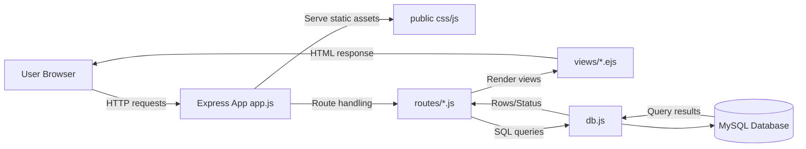
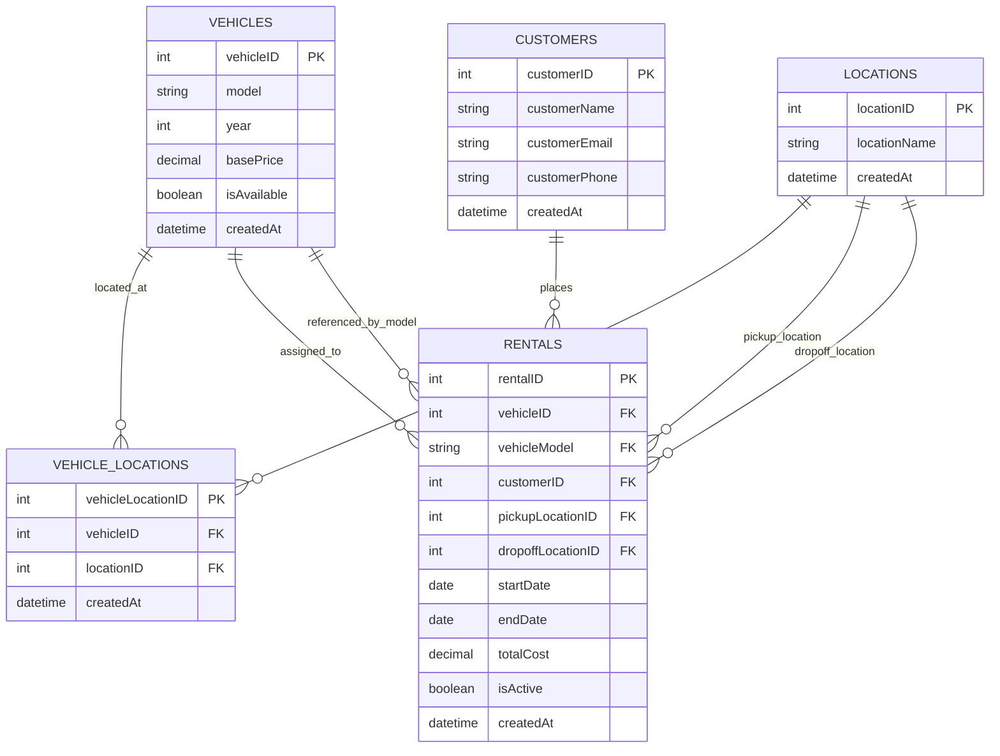

# Vehicle Rental Management System (VRMS)

A simple web application for managing vehicle rental records.

## Overview

Manage fundamental elements of a typical vehicle rental business via GUI triggering standard CRUD operations.

## Try It

1. Open [the deployed webapp](https://cs340g27-production.up.railway.app/) in any browser.
2. Use the navigation bar to switch between Customers, Vehicles, Locations, Rentals, and Vehicle-Locations.
3. Add, update, or delete new records using the forms on each page.
4. Use the reset option only if you want to restore the database to its initial sample state.

### Primary Entities and CRUD Operations

| Entity | Create | Read | Update | Delete |
| --- | --- | --- | --- | --- |
| Vehicles | Yes | Yes | Yes | Yes |
| Customers | Yes | Yes | No | Yes |
| Locations | Yes | Yes | No | Yes |
| Rentals | Yes | Yes | No | Yes |
| Vehicle Locations | No | Yes | Yes | No |

### Key Features

**Business Logic:**
- Prevents deletion of customers or vehicles with active rentals
- Validates that rental start dates don't exceed end dates
- Tracks vehicle availability and prevents double-booking
- Vehicle model updates with stored procedure support

**Data Integrity:**
- Foreign key constraints with cascade delete for supporting tables
- Unique constraints on customer emails/phones and vehicle models
- Check constraints ensuring non-negative prices and valid date ranges
- Stored procedures for complex operations (CreateCustomer, UpdateVehicle, ResetDatabase)

## Architecture

VRMS uses a server-rendered MVC-style structure where the browser interacts with Express routes, routes query MySQL, and EJS templates render HTML responses.




## Database Schema
All tables include timestamps and enforce data integrity with foreign key constraints.


### Technology Stack

- **Frontend:** Bootstrap
- **Backend:** Express.js
- **Database:** MySQL

### Project Structure

```
app.js                    # Main application entry point
db.js                     # Database connection management
package.json              # Project dependencies
DDL.sql                   # Database schema definitions
DML.sql                   # Initial data population
PL.sql                    # Stored procedures and triggers
routes/                   # Express route handlers
  ├── customers.js
  ├── vehicles.js
  ├── locations.js
  ├── rentals.js
  └── vehicles_locations.js
views/                    # EJS template files
  ├── customers/
  ├── vehicles/
  ├── locations/
  ├── rentals/
  ├── vehicles_locations/
  └── partials/
public/                   # Static assets (CSS, JavaScript)
  ├── css/
  └── js/
```

## Disclaimer
Not suitable for actual business/production use. Created for Oregon State University's CS340 (Intro to Databases) in Fall of 2025. Intended to demonstrate basic competencies in database design and implementation.