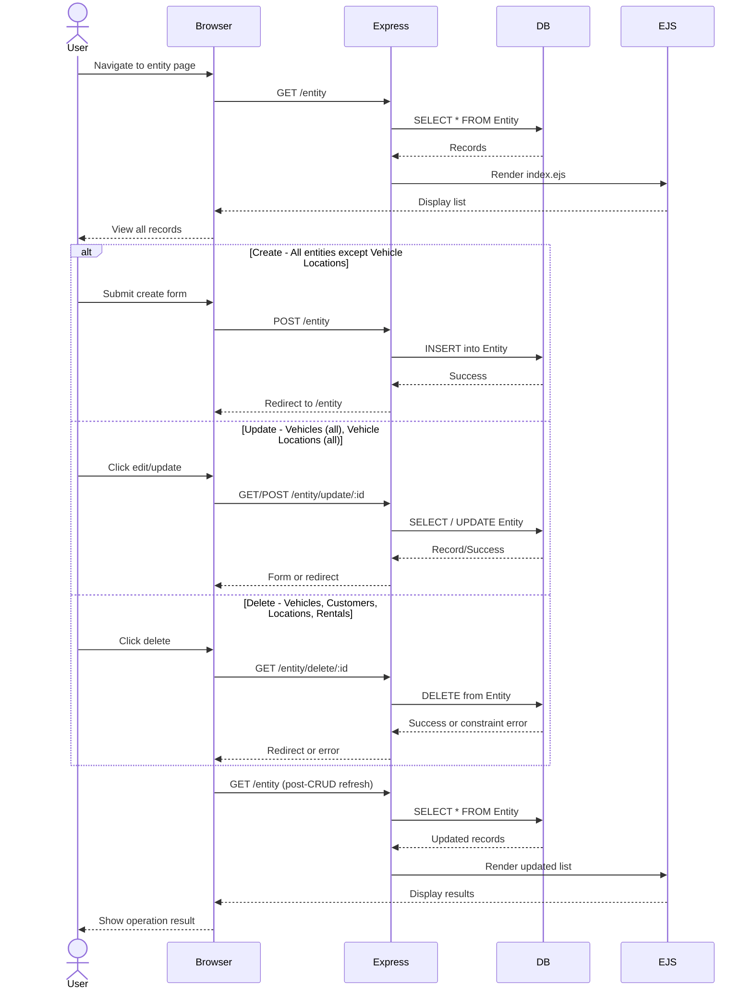
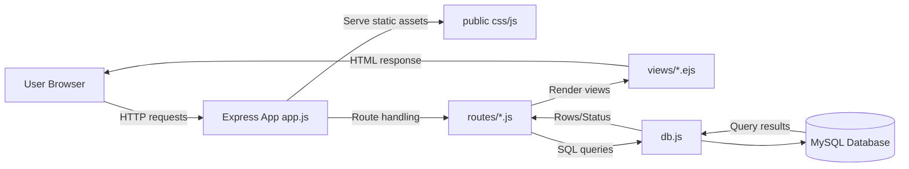
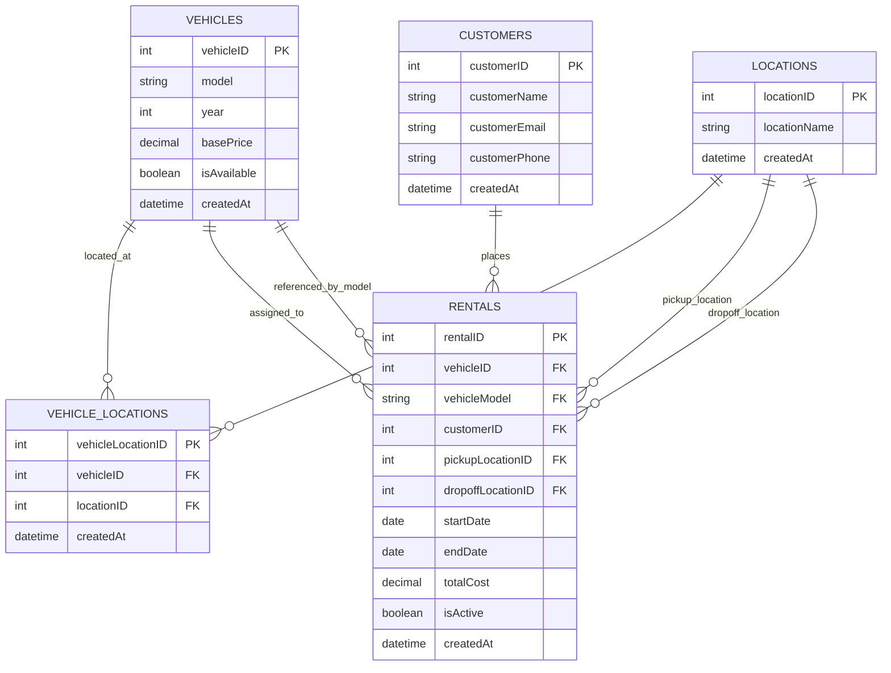

# Vehicle Rental Management System (VRMS)

A simple web application for managing vehicle rental records. Try it [here](https://cs340g27-production.up.railway.app/).

## Overview

Manage fundamental elements of a typical vehicle rental business via GUI triggering standard CRUD operations.

### Primary Entities and CRUD Operations

| Entity | Create | Read | Update | Delete |
| --- | --- | --- | --- | --- |
| Vehicles | Yes | Yes | Yes | Yes |
| Customers | Yes | Yes | No | Yes |
| Locations | Yes | Yes | No | Yes |
| Rentals | Yes | Yes | No | Yes |
| Vehicle Locations | No | Yes | Yes | No |

### General CRUD Flow



### Key Features

**Business Logic:**
- Prevents deletion of customers or vehicles with active rentals
- Validates that rental start dates don't exceed end dates
- Tracks vehicle availability and prevents double-booking
- Automatic timestamp tracking for all records
- Rental calculations with total cost tracking
- Vehicle model updates with stored procedure support

**Data Integrity:**
- Foreign key constraints with cascade delete for supporting tables
- Unique constraints on customer emails/phones and vehicle models
- Check constraints ensuring non-negative prices and valid date ranges
- Stored procedures for complex operations (CreateCustomer, UpdateVehicle, ResetDatabase)

## Architecture

VRMS uses a server-rendered MVC-style structure where the browser interacts with Express routes, routes query MySQL, and EJS templates render HTML responses.



## Getting Started

1. Open [the deployed webapp](https://cs340g27-production.up.railway.app/) in your browser.
2. Use the navigation bar to switch between Customers, Vehicles, Locations, Rentals, and Vehicle-Locations.
3. Add new records using the forms on each page, and use the edit or delete actions where available.
4. Review rentals to see which vehicles are active, available, or associated with specific customers and locations.
5. Use the reset option only if you want to restore the database to its initial sample state.

## Database Schema
All tables include timestamps and enforce data integrity with foreign key constraints.



### Technology Stack

- **Frontend:** Bootstrap
- **Backend:** Express.js
- **Database:** MySQL

### Project Structure

```
app.js                    # Main application entry point
db.js                     # Database connection management
package.json              # Project dependencies
DDL.sql                   # Database schema definitions
DML.sql                   # Initial data population
PL.sql                    # Stored procedures and triggers
routes/                   # Express route handlers
  ├── customers.js
  ├── vehicles.js
  ├── locations.js
  ├── rentals.js
  └── vehicles_locations.js
views/                    # EJS template files
  ├── customers/
  ├── vehicles/
  ├── locations/
  ├── rentals/
  ├── vehicles_locations/
  └── partials/
public/                   # Static assets (CSS, JavaScript)
  ├── css/
  └── js/
```
